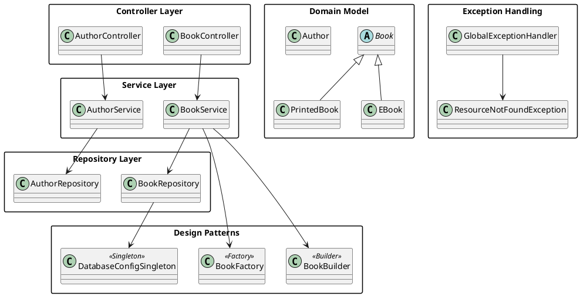

# Endterm Project – Spring Boot REST API

## 📌 Project Overview
This project is a **Spring Boot REST API** developed as an **Endterm Project** for the Object-Oriented Programming course.

The goal of the project is to demonstrate:
- Object-Oriented Programming principles
- SOLID principles
- Design Patterns
- Component Principles
- REST API architecture
- Database integration
- API testing with Postman

---

## 🛠 Technologies Used
- Java 25
- Spring Boot
- Spring Web
- Spring Data JPA
- Hibernate
- PostgreSQL
- Maven
- Postman

---

## Project Structure
```text
src/
└── main/
    ├── java/
    │   └── app/
    │       ├── controller/
    │       ├── service/
    │       ├── repository/
    │       ├── model/
    │       ├── patterns/
    │       ├── exception/
    │       └── Application.java
    └── resources/
        └── application.properties

```
## 🔁 REST API Endpoints

### Author API
| Method | Endpoint | Description |
|------|---------|-------------|
| GET | `/api/authors` | Get all authors |
| GET | `/api/authors/{id}` | Get author by ID |
| POST | `/api/authors` | Create new author |
| PUT | `/api/authors/{id}` | Update author |
| DELETE | `/api/authors/{id}` | Delete author |

### Book API
| Method | Endpoint | Description |
|------|---------|-------------|
| GET | `/api/books` | Get all books |
| POST | `/api/books` | Create new book |
| DELETE | `/api/books/{id}` | Delete book |

---

## 📦 JSON Examples

### Create Author
```json
{
  "name": "George Orwell"
}
```
### Create books
```json
{
  "name": "1984",
  "price": 19.99,
  "authorId": 1,
  "bookType": "PRINTED",
  "pages": 328
}
```
## 🧪 API Testing (Postman)

All REST API endpoints were tested using **Postman**.

The following operations were successfully tested:
- GET requests
- POST requests
- DELETE requests
- Error handling (404, 500)

Postman was used to send HTTP requests and verify correct responses from the server.
Screenshots of Postman requests and responses are included in the project documentation.

---

## 🧩 Design Patterns Used

### 1️⃣ Singleton Pattern
The Singleton pattern is used to manage configuration or database-related logic by ensuring that only one instance of the class exists during application runtime.

**Purpose:**
- Ensures a single shared instance
- Centralizes configuration logic
- Improves resource management

---

### 2️⃣ Factory Pattern
The Factory pattern is used to create different types of books such as `EBook` and `PrintedBook`.

**Purpose:**
- Encapsulates object creation logic
- Demonstrates polymorphism
- Makes the code extensible and maintainable

---

### 3️⃣ Builder Pattern
The Builder pattern is used to construct complex `Book` objects step by step.

**Purpose:**
- Improves code readability
- Avoids large constructors
- Allows flexible object creation

---

## 🧱 Component Principles

### REP – Reuse/Release Equivalence Principle
Reusable components are grouped together and released as a unit.

### CCP – Common Closure Principle
Classes that change for the same reason are placed in the same package.

### CRP – Common Reuse Principle
Classes that are reused together are grouped together, minimizing unnecessary dependencies.

---

## ⚙️ OOP & SOLID Principles

- **Single Responsibility Principle**  
  Each class has only one responsibility.

- **Open/Closed Principle**  
  The system is open for extension but closed for modification.

- **Liskov Substitution Principle**  
  Subclasses (`EBook`, `PrintedBook`) can replace their base class without breaking functionality.

- **Interface Segregation Principle**  
  Interfaces are small and specific to client needs.

- **Dependency Inversion Principle**  
  High-level modules depend on abstractions, not on concrete implementations.

---

## 🚨 Exception Handling
Global exception handling is implemented using `@ControllerAdvice`.

Handled cases include:
- Resource not found (404)
- Invalid input data
- Internal server errors (500)

---

## 🗄 Database
- PostgreSQL is used as the database
- One-to-Many relationship:
    - One Author → Many Books
- Hibernate automatically generates and updates database tables

---

## ▶️ How to Run the Project

1. Clone the repository to your local machine.
2. Make sure PostgreSQL is installed and running.
3. Create a PostgreSQL database named `library`.
4. Configure the database connection in `application.properties`:
`spring.datasource.url=jdbc:postgresql://localhost:5432/library`
`spring.datasource.username=postgres`
`spring.datasource.password=your_password`
`spring.jpa.hibernate.ddl-auto=update`

5. Open the project in IntelliJ IDEA.
6. Run the `Application.java` file.
7. The application will start on:

http://localhost:8080

---

## 📊 UML Diagram
The UML class diagram is included in the project documentation and demonstrates the relationships between entities, services, repositories, and controllers.

---

## 🧠 Reflection
This project helped me to understand:
- How to build REST APIs using Spring Boot
- How to structure a layered backend application
- How to apply OOP and SOLID principles in practice
- How to use design patterns in real projects
- How to work with PostgreSQL and JPA

---

✅ **Endterm Project successfully completed**
